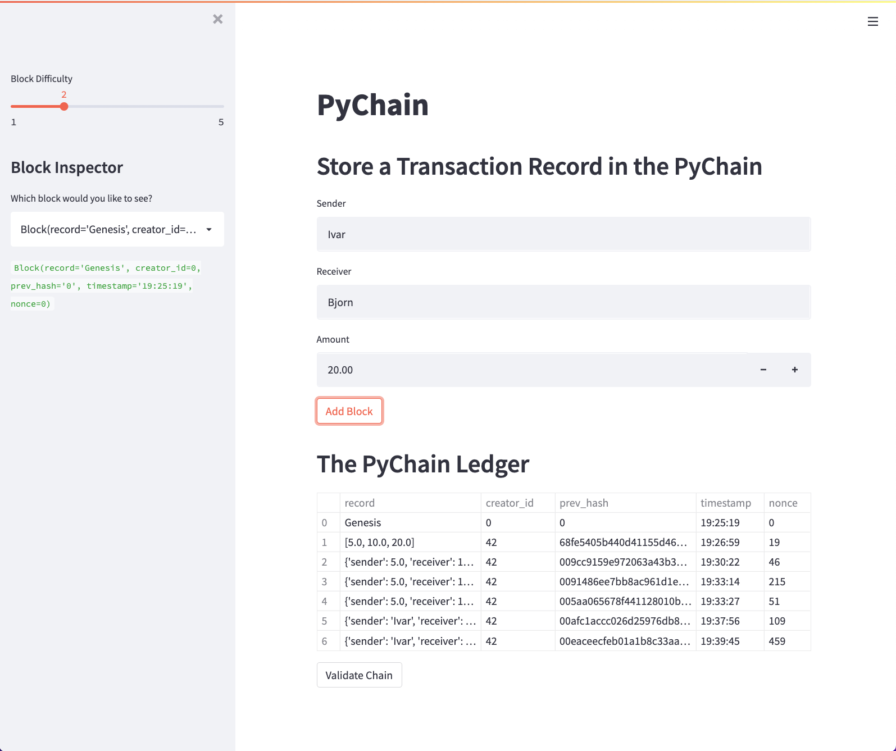

# Challenge 18 | Peter Lieberman | PyChain Ledger

PyChain Ledger is a a blockchain-based ledger system, complete with a user-friendly web interface hosted on Streamlit. This ledger allows partner banks to conduct financial transactionsand to verify the integrity of the data in the ledger.


## Technologies

```python
The program uses pandas, dataclasses, typing, hashlib, streamlit, and datetime.
```

---

## Usage

The application takes several user inputs. The users selects a sender, receiver, and an amount to send. It also allows users to select a "block difficulty" and to view the block under the "Block Inspector." It then prints out a record of the PyChain Ledger and to verify that the data is correct.

---

## Streamlit Log



---

## License

MIT License
