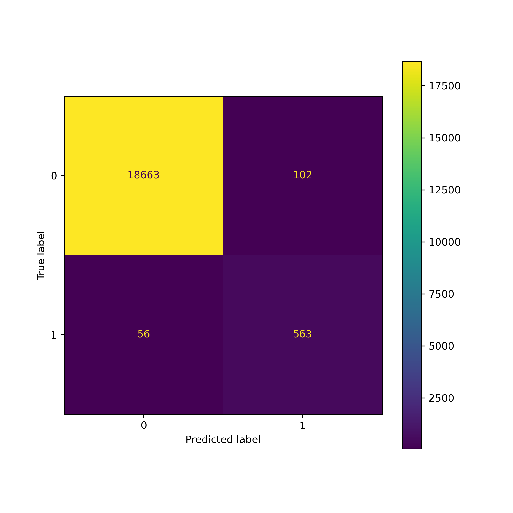
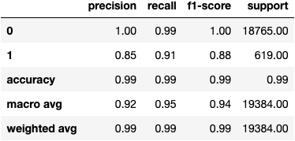
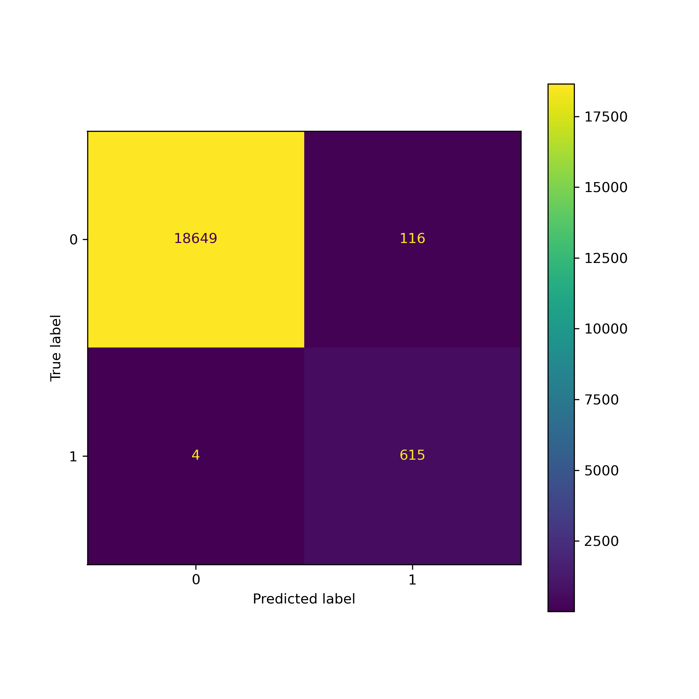
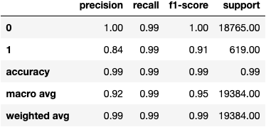

# Credit Risk Analysis #

Two logistic regression model were trained for a peer-to-peer lending services company to identify the credit worthiness of future borrowers. The model analyzes historical lending data to classify loans as "healthy" or "risky." 

## Problem ##

Credit risk poses a classification problem that’s inherently imbalanced, because healthy loans outnumber risky loans. For the FinTech lending company it is more important to identify the risky loans. The problem is that there is limited data on risky loans, so we need a solution to resolve the imbalanced data set.

## Method ##

We use a dataset of historical lending activity to train and evaluate two models using the imbalanced classes. A logistic regression is used, because it can train a classifier to make a binary decision about the class of a new input observation. The second model resamples the training data used in the first model by using the RandomOverSampler module to resolve the imbalance. This helps the model avoid hyperfocusing on the healthy loans to improve predictions for the risky loans.

## Results ##

Model 2 performed better than the Model 1. The accuracy and recall scores for Model 2 are noticeably better than for Model 1.

* Machine Learning Model 1:
The model predicts the healthy loans with 95% accuracy, 100% precision, and 99% recall, and the high-risk loans with 85% precision and 91% recall.

* Machine Learning Model 2:
The model predicts the healthy loans with 99% accuracy, 100% precision, and 99% recall, and the high-risk loans with 84% precision and 99% recall.

