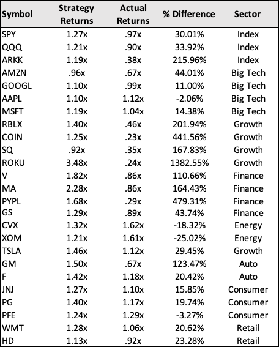
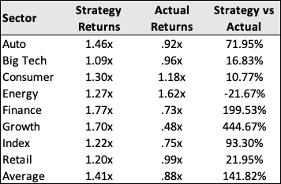

# Algorithmic Trading Bots | Machine Learning Models

This is the beta version of an algorthmic trading model. The program connects to the YFinance API and pulls price data for any ticker symbol. It build a linear regression parallel channel to create buy/sell signals and optimizes returns through the following machine learning algorithms.

* Logistic Regression
* Random Forest Classification
* Support Vector Machine (SVM)

The live app can be viewed on [Streamlit](https://share.streamlit.io/pac1226/algorithmic-trading-models/main/mlmodel.py)

---

## Technologies

```python
The program uses Streamlit, Pandas, NumPy, Scikit-learn, Pathlib, FinancialAnalysis libraries. 
```

---

## Results

The algorithmic trading model was backtested with 25 stocks and outperformed a buy/hold strategy by 141%. It produced an average return of 41% across the 25 stocks over a one year period. A buy/hold strategy would've returned -12%. The algorithm performs better with high beta stocks and underperforms with energy stocks.

The algorithm bought a stock when its price dropped below the long-term trendline and sold it when the price rose above it. The buy/sell signals can be changed to optimize returns. For example, the buy signal can be set to "2 Standard Deviations (Below)" the mean and the sell signal to "1 Standard Deviation (Above)" the mean.

Returns were optimized by applying the Logistic Regression, Random Forest Classification, and Support Vector Machine algorithms. They all failed to outpeform the human-designed trading bot, but often outperformed the buy/hold strategy.

The following results are from 05/01/21 to 05/16/22.




